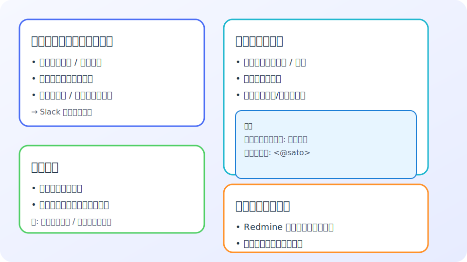

# 日次ミーティング スケジューラー

Redmine のプロジェクトとメンバーをベースに、日次ミーティングのファシリテーター依頼をカレンダー上で管理できるデモアプリです。
アジェンダはテンプレートまたは自由入力に対応し、Slack Incoming Webhook を設定すればスケジュール確定と同時に通知も送信できます。

画面の構成イメージを以下に示します。



```mermaid
---
title: 画面レイアウト概要
---
flowchart LR
    controls[プロジェクトとメンバーの管理\n(Redmine 再取得・カスタム登録)]
    form[スケジューリングフォーム\n(プロジェクト/メンバー/アジェンダ入力)]
    calendar[月間カレンダー\n(登録済みミーティング表示)]
    controls --> form
    controls --> calendar
    form --> calendar
```

## 主な機能
- プロジェクトとメンバーを選択してミーティングを登録
- Redmine API から取得したプロジェクト・メンバーとアプリ内で追加したカスタムデータを統合
- 日付・開始時刻を指定して予定をカレンダーに追加
- アジェンダテンプレートまたは自由入力に対応
- Slack Incoming Webhook を利用した通知（任意）

## セットアップ

Node.js 18 以上をインストールしてください。

```bash
npm install
```

Slack に通知したい場合は、[Incoming Webhook](https://api.slack.com/messaging/webhooks) を作成し、URL を環境変数に設定してください。

```bash
export SLACK_WEBHOOK_URL="https://hooks.slack.com/services/..."
```

### Redmine API 連携

Redmine からプロジェクトとメンバーを取得する場合は、ベース URL と API キー（必要に応じて）を環境変数に設定します。

```bash
export REDMINE_BASE_URL="https://redmine.example.com"
export REDMINE_API_KEY="xxxxxxxxxxxxxxxxxxxxxxxxxxxxxxxx"
```

- `REDMINE_BASE_URL` は Redmine のルート URL を指定します。末尾の `/` は不要です。
- API キーは Redmine の「マイアカウント」>「API アクセスキー」から確認できます。公開情報のみ利用する場合は省略可能です。
- アプリは `/projects.json` と `/projects/:id.json?include=memberships` を呼び出して最新のプロジェクトとメンバーを取得します。
- 取得に失敗した場合や環境変数が未設定の場合は、`data/projects.json` のローカル定義を自動的に利用します。
- 画面の「Redmine から再取得」ボタンでいつでも再同期できます。ローカルで追加したカスタムデータは保持されます。

## 使い方

```bash
npm run start
```

ローカル環境では `http://127.0.0.1:3000/` にアクセスするとフォームとカレンダーが表示されます。
ポート番号を変更したい場合は `PORT` 環境変数を指定してください。

```bash
PORT=8080 npm run start
```

1. プロジェクトとファシリテーター、日付・時刻を選択します。
2. テンプレートまたは自由入力でアジェンダを整え、「ミーティングをスケジュール」を押します。
3. 登録された予定は右側のカレンダーに表示され、Slack Webhook を設定していれば同時に通知されます。

## データのカスタマイズ

- `data/projects.json`: Redmine から取得したいプロジェクトとメンバーを編集します。
- `data/agenda_templates.json`: アジェンダのテンプレートを編集できます。
- `data/schedule.json`: 初期表示するスケジュールのサンプルです。フォーマットは API レスポンスと同一です。
- `data/custom_data.json`: 画面から追加したカスタムプロジェクトや追加メンバーを保持します。手動で編集することもできます。

画面上部の「プロジェクトとメンバーの管理」セクションから、Redmine のデータに加えてこのアプリ専用のプロジェクトやメンバーを登録できます。
Redmine API とローカルカスタマイズを統合した結果がスケジューリングフォームとカレンダーに反映されます。

## チェック

サーバーの構文チェックには次のコマンドを利用できます。

```bash
npm run check
```

